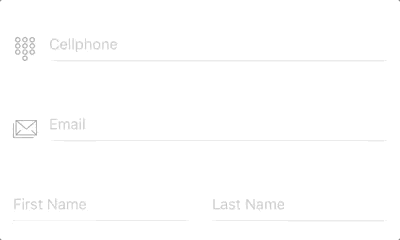
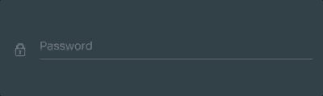

# RYFloatingInput
RYFlotingInput, inspired by "Floating Label Pattern" and implemented with RxSwift & mvvm pattern, provides a fully-customizable textfield input control along with a painless input text validation.

[](https://travis-ci.org/eebolue/RYFloatingInput)
[](http://cocoapods.org/pods/RYFloatingInput)
[](http://cocoapods.org/pods/RYFloatingInput)
[](http://cocoapods.org/pods/RYFloatingInput)

<p align="center">
    
</p>

## Features
- Float label pattern
- Customization support: theme, color, icon
- Straightforward text input validation and callbacks

## Installation
#### CocoaPods
Available on CocoaPods. Simply add the following to your project Podfile, and you're good to go.

```ruby
pod 'RYFloatingInput'
```

## Getting Started
#### Setup from InterfaceBuilder
1. Drag a UIView instance into your UIViewController/UIView
2. Change the class of the UIView instance to `RYFloatingInput`.
3. Change the module of the UIView instance to `RYFloatingInput`.
2. Link to the IBOutlet instance of your UIViewController/UIView.

#### Setup Programmitacally
Create an `RYFloatingInput` instance and add to superview
```swift
let floatingInput = RYFloatingInput(frame: frame)
self.view.addSubview(floatingInput)
```

## Usage
* [Setting Builder](#setting_builder)
* [Input Text Validation](#text_validation)
* [Theme & Color Customization](#theme_customization)
* [Divider Height](#divider_height)
* [Icon / Placeholder / Secure Text](#other)

<a id='setting_builder'></a>
### Setting Builder
`RYFloatingInputSetting` is required for `RYFloatingInput` to work properly, which concise all the settings and customizations together into one single builder function. Here are the steps:
1. Initialize `RYFloatingInputSetting` instance by using `RYFloatingInputSetting.Builder`
2. Add features & customizations
3. Setup `RYFloatingInput` by created `RYFloatingInputSetting` instance

Example:
```swift
let setting = RYFloatingInputSetting.Builder.instance()
    .theme(.dark)
    .iconImage(UIImage(named: "image_name")!)
    .placeholer("I AM PLACEHOLDER")
    .secure(true)
    .build()

floatingInput.setup(setting: setting)
```

<a id='text_validation'></a>
### Input Text Validation
Setting up text validation is totally painless in `RYFloatingInput` by simply adding `.maxLength` or `.inputType` implementation in setting builder and it's done. You can also customize warning message along with a callback event triggered at any invalid input occurrence. Complex delegation is not needed.

2 options for input Type validation:
- `.number` - only accept numeric input.
- `.regex(pattern: String)` - check input text with regular expression you want.

Example:
```swift
RYFloatingInputSetting.Builder.instance()
    .theme(.standard)
    .maxLength(8, onViolated: (message: "Exceed max length", callback: {
        print("Exceed max length")
    }))
    .inputType(.number, onViolated: (message: "Invalid input, number only", callback: {
        print("Invalid input, number only")
    }))
    .build()
```
<a id='theme_customization'></a>
### Color & Theme Customization
**Color Customization** is implemented for almost every component in `RYFloatingInput`, such as background, divider, placeholer, divider, warning label, and input cursor.
Here are the color customization options provided:

```swift
RYFloatingInputSetting.Builder.instance()
    .backgroundColor(.clear)
    .textColor(.darkText)
    .placeholderColor(.lightGray)
    .dividerColor(.lightGray)
    .cursorColor(.blue)
    .accentColor(.cyan)
    .warningColor(.red)
    .build()
```

Normally, divider and floating label are displayed as accent color while highlighted, and will turn into warning color once invalid text input has entered.



**Theme** is a easier way to customize colors which covers all color options described above. 3 theme options are definded in `RYFloatingInput.Theme`:
- `.standard` - default
- `.light`
- `.dark`

```swift
RYFloatingInputSetting.Builder.instance()
    .theme(.light)
    .build()
```
Please note that if theme and color customization, e.g. textColor, are both setup in builder, the text color from theme will be ignored.

<a id='divider_height'></a>
### Divider Height
3 divider height options are provided: `.thin`, `.regular`, `.bold`. Defaults to `.regular`.
```swift
RYFloatingInputSetting.Builder.instance()
    .dividerWeight(.thin)
    .build()
```

<a id='other'></a>
### Icon / Placeholder / Secure Text
Setting input icon, placeholder, secure text options.

```swift
RYFloatingInputSetting.Builder.instance()
    .iconImage(UIImage(named: "image_name")!)
    .placeholer("I AM PLACEHOLDER")
    .secure(true)
    .build()
```

## TODO
- [x]   Customizable divider height - v0.1.2
- [ ]   Support customized font
- [ ]   Multiple text validation conditions
- [ ]   Activity indicator & asyncronous task completion event

## Dependency
[RxSwift](https://github.com/ReactiveX/RxSwift) - Reactive Programming in Swift


## License
RYFloatingInput is available under the MIT license. See the LICENSE file for more info.


## Author
Ray ChengJui YU - eebolue@gmail.com


